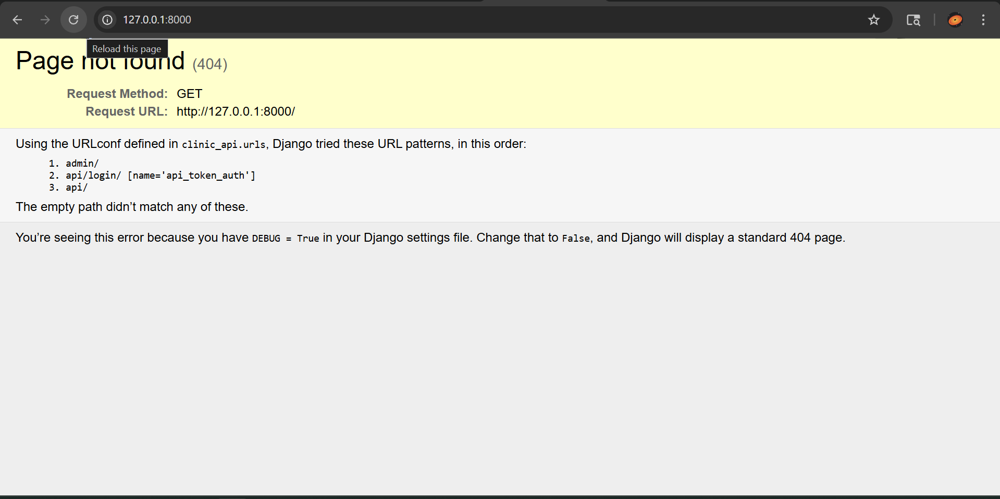

# Clinic API



A simple and intuitive REST API built with Django and Django REST Framework for managing clinic patients and appointments.

## Features
- **Patient Records:** Add, update, view, and delete patient details.
- **Appointments:** Schedule and track patient visits.
- **Search & Filtering:** Search patients by name and filter appointments by status or patient.
- **Upcoming Appointments:** Custom endpoint to quickly list future scheduled appointments.
- **Dashboard Stats:** Overall count of total patients and appointments.
- **Token Authentication:** Secure endpoints using DRF's token-based authentication.
- **Consistent Responses:** Unified JSON structure for data payloads and error handling.

## Tech Stack
- Python 3
- Django 5.1
- Django REST Framework 3.15
- SQLite (built-in)

## Endpoints Summary

### Auth
- `POST /api/login/` - Submit username/password to receive an Auth Token.

### Patients
- `GET /api/patients/` - List all patients (use `?search=Name` to search).
- `POST /api/patients/` - Create a new patient.
- `GET /api/patients/<id>/` - Retrieve specific patient details.
- `PUT/PATCH /api/patients/<id>/` - Update a patient's data.
- `DELETE /api/patients/<id>/` - Delete a patient record.

### Appointments
- `GET /api/appointments/` - List all appointments (use `?status=Scheduled` or `?patient=<id>` to filter).
- `POST /api/appointments/` - Schedule a new appointment.
- `GET /api/appointments/upcoming/` - List all future scheduled appointments.
- `GET /api/appointments/<id>/` - View details for an appointment.
- `PUT/PATCH /api/appointments/<id>/` - Update or mark an appointment as cancelled/completed.
- `DELETE /api/appointments/<id>/` - Remove an appointment.

### Stats
- `GET /api/stats/` - Get a simple dashboard view (total patients and appointments).

## Local Setup
Ensure you have Python installed, then run the following in your terminal:

1. Install requirements:
   ```bash
   pip install -r requirements.txt
   ```

2. Run migrations:
   ```bash
   python manage.py migrate
   ```

3. Create an admin user (if you want to use the Django Admin panel or generate a token):
   ```bash
   python manage.py createsuperuser
   ```

4. Start the server:
   ```bash
   python manage.py runserver
   ```

*Note: Except for the login endpoint, all API endpoints require authentication. Pass `Authorization: Token <your_token_here>` in your request headers.*
